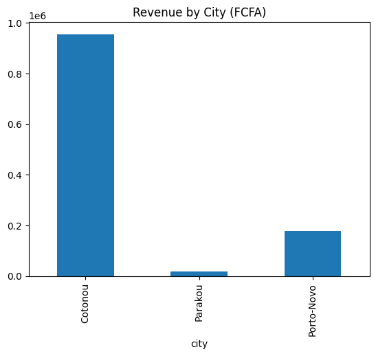
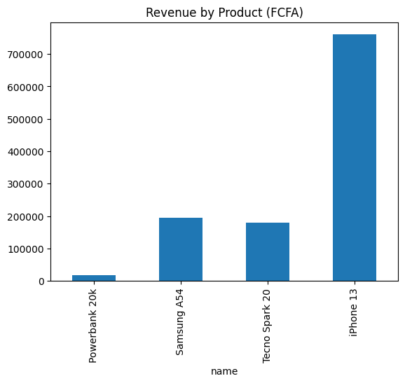

# Data Analyst Portfolio | Owolabi Lawal - Cotonou, Benin 🇧🇯

## Project 1: Marc Shop - Profit Analysis
Real client project for small shop in Benin.
- Top Product: iPhone 13 case - 15,000 profit
- Power bank: 12,000 profit  
- Screen protector: 12,000 profit
- Total: 39,000 profit
- File: marc.xlsx

## Project 2: Tech Shop BJ - Benin Market [BUILT TONIGHT 2:50 AM!]
Bigger shop analysis with 7 sales across Benin cities.
- **Total Revenue:** 1,153,000 FCFA
- **Total Profit:** 186,000 FCFA
- **Top City:** Cotonou
- **Top Product:** iPhone 13 (760,000 FCFA revenue)
- **Tools Used:** Excel VLOOKUP, MySQL JOIN, Python pandas + matplotlib
- **Proof:** Same 1,153,000 result in Excel, MySQL, Python!

### Charts

### Files
- tech_sales_2024.xlsx (products + sales sheets)
- 1_revenue_by_city.png
- 2_revenue_by_product.png

**Tech Stack:** Excel, MySQL, Python, GitHub, Google Colab
Built by Lawal19940
